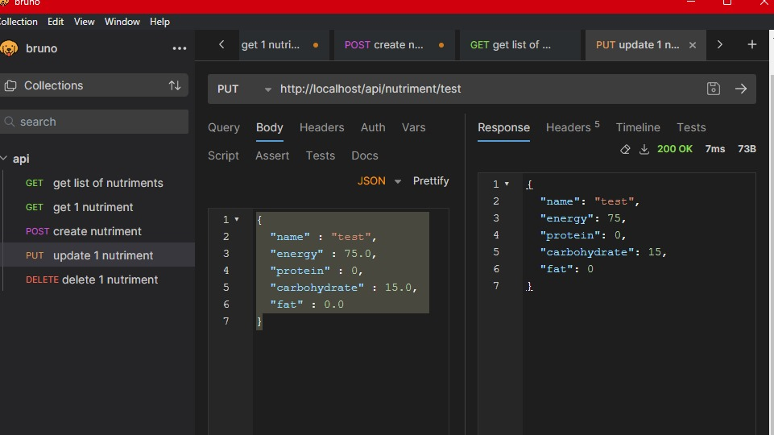

# DAI_HTTP
# Partie 1
L'objectif de cette étape est de construire une image Docker qui contient un serveur HTTP statique Nginx. 
Le serveur servira un site Web statique. Le site Web statique sera une page unique avec un modèle agréable à regarder.
* Le dossier du site Web statique s'appelle "web" : HTTP/web
* Le fichier Dockerfile est rempli selon l'image Nginx et copie le site web statique dans le répertoire : /usr/share/nginx/html
* Le fichier nginx.conf est rempli avec la configuration Nginx pour servir le site Web statique

Nous avons téléchargé le template du site Free CSS : https://www.free-css.com qui est le site web statique.
Il est dans HTTP/web/content

### Dockerfile configuration
```dockerfile
# Utilise l'image Docker officielle de Nginx comme base.
# Cette image sert de point de départ et contient le serveur Nginx et toutes ses dépendances.
FROM nginx:latest

# Copie les fichiers du site web statique du dossier 'content' du répertoire local
# vers le dossier '/usr/share/nginx/html' dans l'image Docker.
# '/usr/share/nginx/html' est le répertoire par défaut où Nginx sert les fichiers.
COPY ./content /usr/share/nginx/html

# Informe Docker que le conteneur écoute sur le port 80 lors de son exécution.
# Cela ne publie pas le port, mais sert de documentation entre le conteneur et l'extérieur.
EXPOSE 80

# Définit la commande par défaut pour exécuter lorsque le conteneur est lancé.
# Ici, il s'agit de démarrer le serveur Nginx en mode foreground (pas en tant que daemon).
CMD ["nginx", "-g", "daemon off;"]

```
Comment construire l'image Docker ? Depuis le répertoire web
```bash
docker build -t mynginx .
```
Comment exécuter l'image Docker ? Depuis le répertoire web
```bash
docker run -d -p 80:80 mynginx
```
Il est possible de vérifier que le site Web est accessible en utilisant un navigateur Web et en accédant à l'URL : http://localhost

# Partie 2
L'objectif de cette étape est d'utiliser Docker compose pour déployer une première version de l'infrastructure avec un seul service : le serveur Web statique.
En plus de la configuration de base de Docker compose, nous voulons pouvoir reconstruire l'image Docker du serveur Web.

Nous avons modifier le fichier docker-compose.yml pour ajouter un service nommé site-a et un autre site-b. 
Comme nous voulons pouvoir reconstruire l'image Docker du serveur Web, nous avons également ajouté un build context et un chemin vers le Dockerfile.
Pour le site-b on est resté simple et on a déployé le site web statique dans le répertoire /usr/share/nginx/html de l'image Docker Nginx.
### Fichier Docker compose - docker.yml 
```yaml
services:
  site-a:
    image: web # Utilise l'image Docker officielle de Nginx pour le service site-a.
    ports:
      - "8080:80" # Redirige le trafic du port 8080 de l'hôte vers le port 80 du conteneur. 
                  # Le commentaire "THIS DOES NOT WORK" suggère un problème de fonctionnement.
                  # Vérifiez si le port 8080 est déjà utilisé ou accessible sur l'hôte.
    volumes:
      - ./web # Monte le contenu du dossier local site-a 
                                       # dans le répertoire où Nginx sert les fichiers statiques.

  site-b:
    image: nginx # Utilise la même image Docker officielle de Nginx pour le service site-b.
    ports:
      - "8081:80" # Redirige le trafic du port 8081 de l'hôte vers le port 80 du conteneur.
                  # Le même commentaire ici indique un problème similaire au service site-a.
                  # Assurez-vous que le port 8081 n'est pas en conflit avec d'autres services.
    volumes:
      - ./site-b:/usr/share/nginx/html # De la même manière, monte le contenu du dossier local site-b 
                                       # dans le répertoire de Nginx pour les fichiers statiques.

```

Les commandes suivantes permettent de construire et de démarrer les services.
```bash
docker-compose build
docker-compose up
```

Pour les tester, il faut utiliser un navigateur Web et accéder aux URL suivantes :
* http://localhost:8080
* http://localhost:8081


# Partie 3
L'objectif est de construire une API HTTP avec Javalin.
Nous avons construit une API CRUD permettant de gérer les nutriments d'un aliment, nous avons par exemple le niveau de protéine, energie , carbohidrate, etc.
Elle est très simple et ne contient que 5 méthodes :
* GET api/nutriments : renvoie la liste des nutriments
* GET api/nutriments/{name} : renvoie le nutriment du nutriment avec le nom {name}
* POST api/nutriments/ : ajoute un nouveau nutriment à la liste
* PUT api/nutriments/{name} : met à jour le nutriment avec le nom {name}
* DELETE api/nutriments/{name} : supprime le nutriment avec le nom {name}


### Test de l'API
Pour tester l'API, nous avons utilisé Bruno, un outil de test d'API REST.
* GET api/nutriments

* GET api/nutriments/{name}

* POST api/nutriments/ 

* PUT api/nutriments/{name} 

* DELETE api/nutriments/{name}


### Configuration Dockerfile
```dockerfile
# Utilise l'image eclipse-temurin comme base.
FROM eclipse-temurin:latest
# nous copions le fichier JAR exécutable de l'application dans le répertoire /app de l'image
COPY ./target/app.jar /app.jar
# nous définissons le port sur lequel l'application sera exposée
EXPOSE 7070
# nous définissons la commande par défaut pour exécuter l'application
ENTRYPOINT ["java", "-jar", "/app.jar"]
```
### Ajouter le service API dans le fichier docker-compose.yml
```yaml
      image: my_api
      build:
       context:
          ./API
       ports:
          - "7070:7070"
```

Pour lancer l'API, il faut utiliser la commande suivante :
```bash
docker compose build
docker compose up
```
# Partie 4
L'objectif de cette étape est de placer un proxy inverse devant les serveurs Web dynamiques et statiques de manière à ce que le proxy inverse reçoive toutes les connexions et les transmette au serveur Web concerné.

Vous utiliserez Traefik comme proxy inverse. 
Traefik s'interface directement avec Docker pour obtenir la liste des serveurs backend actifs. 
Cela signifie qu'il peut s'adapter dynamiquement au nombre de serveurs en cours d'exécution. 
Traefik a la particularité de pouvoir être configuré à l'aide de labels dans le fichier docker compose. 
Cela signifie que vous n'avez pas besoin d'écrire un fichier de configuration pour Traefik, mais que Traefik lira les configurations des conteneurs depuis le moteur Docker à travers le fichier /var/run/docker.sock.

### Configuration du fichier docker-compose.yml
```yaml
version: '3'

services:
      
  api:
      image: my_api
      build:
       context:
          ./API
      labels:
        - "traefik.enable=true"
        - "traefik.http.routers.api.rule=Host(`localhost`) && PathPrefix(`/api`)"
        - "traefik.http.services.api.loadbalancer.sticky=true"
        - "traefik.http.services.api.loadbalancer.server.port=7070"
        - "traefik.http.services.api.loadbalancer.sticky.cookie.name=superCookie"
        - "traefik.http.services.api.loadbalancer.sticky.cookie.secure=true"

      deploy:
        replicas: 3

  site-a:
      image: web
      build:
        context:
          ./web

      labels:
        - "traefik.enable=true"
        - "traefik.http.routers.site-a.rule=Host(`localhost`)"
        - "traefik.http.services.site-a.loadbalancer.server.port=80"
      deploy:
        replicas: 3


  reverse-proxy:
        # The official v2 Traefik docker image
    image: traefik
    # Enables the web UI and tells Traefik to listen to docker
    command: 
       - "--api.insecure=true"
       - "--providers.docker=true"
       - "--providers.docker.exposedbydefault=false"
    ports:
      - "80:80"
      - "8080:8080"
      - "443:443"

    volumes:
        # So that Traefik can listen to the Docker events
        - /var/run/docker.sock:/var/run/docker.sock
```

Il est désormais possible :
- d'accéder au site a à l'adresse http://site-a.localhost/
- d'accéder au Dashboard traefik à l'adresse http://localhost:8080
- d'accéder d'envoyer de requête à notre api à l'adresse http://localhost/api

# Partie 5
L'objectif de cette section est de permettre à Traefik de détecter dynamiquement plusieurs instances de serveurs Web (dynamiques/statiques).

Modifiez votre fichier docker compose de manière à ce que plusieurs instances de chaque serveur soient démarrées. 
Vérifiez que le reverse proxy distribue les connexions entre les différentes instances. 
Ensuite, trouvez un moyen de mettre à jour dynamiquement le nombre d'instances de chaque service avec docker compose, sans avoir à arrêter et redémarrer la topologie.

Pour cette partie, Nous avons rajouté les deploy: replicas: x dans le fichier docker-compose.yml. X = nombre d'instances pour la scalabilité (démarrer plusieurs instances de chaque serveur).
```yaml
deploy:
        replicas: 3
```

Pour modifier de manière dynamique le nombre d'instances, il est simplement nécessaire d'employer la commande ci-dessous, en remplaçant par le nom approprié du service :
```bass
docker-compose up --scale api/site-a=n -d
```
n = nombre d'instance à scaler

# Partie 6
Par défaut, Traefik utilise la méthode round-robin pour répartir la charge entre toutes les instances disponibles. 
Cependant, si un service est sans états, il serait préférable d'envoyer les demandes de la même session toujours à la même instance. 
C'est ce qu'on appelle sticky session.

L'objectif de cette étape est de modifier la configuration de telle sorte que :

Traefik utilise des sessions collantes pour les instances de serveurs dynamiques (service API).
Traefik continue d'utiliser le round robin pour les serveurs statiques (aucun changement n'est nécessaire).

Pour cela, nous avons ajouté les labels suivants dans le fichier docker-compose.yml :
```yaml
labels:
        - "traefik.http.services.api.loadbalancer.sticky=true"
        - "traefik.http.services.api.loadbalancer.sticky.cookie.name=superCookie"
        - "traefik.http.services.api.loadbalancer.sticky.cookie.secure=true"
```
Pour les serveurs statiques, nous avons maintenu la méthode de répartition round-robin qui est déjà le comportement par défaut de Traefik.


Pour évaluer le fonctionnement de ces méthodes, il est nécessaire d'accéder au site et l'API dans un navigateur web et de rafraîchir la page. 
On peut alors observer que, dans le cas du site, une instance différente du service est sollicitée à chaque fois (suivant un ordre régulier, conforme à la logique du round-robin qui assure une distribution équilibrée), 
tandis que pour l'API, c'est systématiquement la même instance qui est utilisée.

# Partie 7

Toute infrastructure web réelle doit être sécurisée avec HTTPS au lieu de HTTP en clair. 
L'objectif de cette étape est de configurer Traefik pour qu'il utilise HTTPS avec les clients.

Cela signifie que HTTPS est utilisé pour la connexion avec les clients, sur l'internet. 
À l'intérieur de l'infrastructure, les connexions entre le proxy inverse et les serveurs se font toujours en HTTP en clair.

Nous avons tout d'abord généré un certificat SSL auto-signé avec openssl :
```bash
openssl req -x509 -newkey rsa:4096 -keyout key.pen cert.key -out cert.pem -sha256 -days 365
```

Par la suite, nous avons inclus dans le fichier Docker Compose le chemin vers le dossier contenant le certificat et la clé privée. Cela a été fait en spécifiant le chemin du dossier dans la section « volumes » de notre service reverse-proxy, qui est le service « traefik ».

```yaml
    volumes:
        # So that Traefik can listen to the Docker events
        - /var/run/docker.sock:/var/run/docker.sock
        - ./certificates:/etc/traefik/certificates
        - ./traefik.yml:/etc/traefik/traefik.yml
```
Cependant, il est à noter qu'il n'est pas faisable de définir l'emplacement du certificat à l'aide de labels. Pour cette raison, nous avons été amenés à créer un fichier de configuration traefik.yaml, en nous guidant grâce à la documentation de Traefik.

Et, pour finir, nous avons ajouté les labels suivants dans le fichier docker-compose.yml :
```yaml
labels:
  - "traefik.http.routers.api.entrypoints=http,https"
  - "traefik.http.routers.api.tls=true"
```
* Pour activer le point d’entrée https 
* Et mettre tls a true